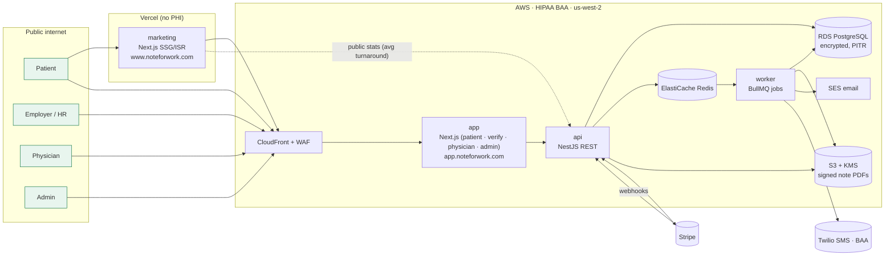
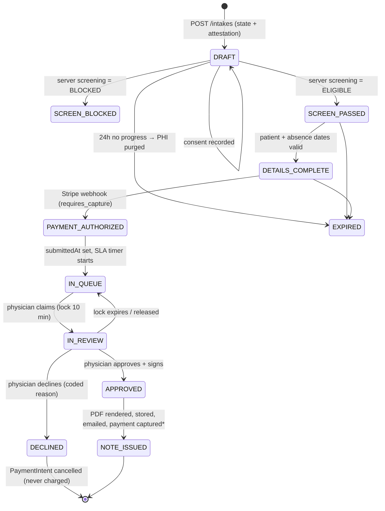
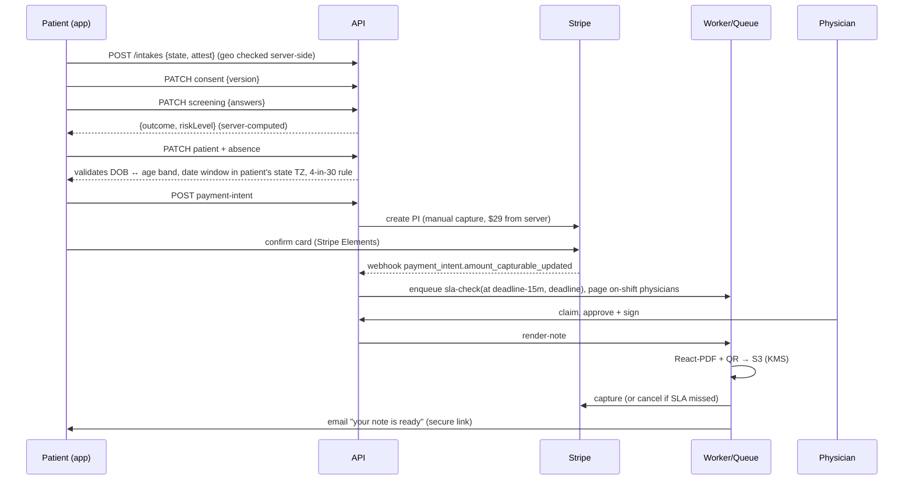

# NoteForWork v2: Target Architecture

_Draft 1 · 2026-10-05 · Based on [01-website-analysis.md](01-website-analysis.md)_

---

## 0. Decisions in this draft

These answer the open questions from the analysis. Each one is a recommendation; change it if needed.

| # | Question | Decision | Why |
|---|---|---|---|
| D1 | One Next.js app or two? | **Two apps:** `marketing` (www) and `app` (app.), sharing UI packages | Keeps every third-party tracker (GA, Ads) physically away from PHI, and lets marketing deploy without touching the HIPAA boundary |
| D2 | Backend style | **Separate NestJS API** + worker process | Screening, payments, SLA timers, signing, and audit need a real service layer. Next.js route handlers alone get messy for that |
| D3 | Hosting | **AWS under a BAA** for app, API, DB, and files. **Vercel** for the marketing site (no PHI) | AWS covers every PHI service under one BAA. Vercel is the best DX for a static/ISR content site |
| D4 | Migrate DrapCode data? | **Yes, for issued notes only**, so every QR/Note ID already given to an employer keeps verifying | Breaking verification of past notes would damage employer trust |
| D5 | Article CMS | **MDX in the repo** to start | ~12 articles, physician-reviewed, low edit frequency. Move to Payload CMS later if non-developers need to edit |
| D6 | Physician portal in v1? | **Yes.** It's the core of the product, and today it lives inside DrapCode | We can't retire DrapCode without it |

---

## 1. Design principles

1. **The server is the only source of truth.** Screening results, risk, IDs, prices, date windows, and eligibility are computed and enforced by the API. The browser only previews.
2. **PHI boundary.** PHI lives only in `app.` → `api` → RDS/S3. No session replay, no ad pixels, and no third-party analytics inside the boundary. Logs and errors are scrubbed.
3. **No PHI before intent.** Nothing about a patient is stored until they actively submit a step. Unpaid drafts are purged automatically.
4. **Everything auditable.** Consent, location attestation, each screening version, every physician action, and every verification lookup are recorded in an append-only audit log.
5. **Money follows the clinical decision.** The card is authorized at checkout and **captured only when a physician approves**. Decline or SLA miss means void or refund automatically, so "only pay if we can help" holds by construction.
6. **Boring, typed, testable.** TypeScript end to end, zod schemas shared between client and server, rules as pure functions with exhaustive tests.

---

## 2. System overview



| Component | Responsibility |
|---|---|
| **marketing** | Landing, resources/articles (MDX), Spanish pages, HR guide, legal pages, careers. Static. Reads one **public, PHI-free** stats endpoint (real average turnaround) |
| **app** | Patient intake wizard, patient portal, employer verification (`/verify-note-details` path kept for old QR codes), physician portal, admin console. Role-gated route groups |
| **api** | All business logic: screening, intake lifecycle, payments, review queue, signing, notes, verification, auth, audit |
| **worker** | SLA timers, PDF rendering, email/SMS, physician paging, draft purge, license-expiry alerts, stats rollup |

---

## 3. Tech stack

| Layer | Choice | Notes |
|---|---|---|
| Language | **TypeScript 6.0** everywhere | Pinned to 6.0 (Nest CLI's version). Move to TS 7 (native compiler) once Nest supports it |
| Monorepo | **Turborepo + pnpm workspaces** | |
| Frontend | **Next.js 16 (App Router), React 19.3** | RSC for marketing; client components for the wizard |
| UI | **Tailwind CSS v4 + shadcn/ui** (Radix) | Existing tokens ported (§10) |
| Forms / validation | **react-hook-form + zod** | Same zod schemas used by the API |
| Data fetching | **TanStack Query** with a generated typed client | |
| API | **NestJS 12** (Fastify 5 adapter) | Modules per domain (§5) |
| API contract | **OpenAPI** generated from Nest, then **orval** generates the typed client and hooks | One source of truth for request/response types |
| ORM / DB | **Prisma 7** (pg driver adapter) + **PostgreSQL 16** | |
| Queue | **BullMQ 6** + ioredis on Redis 7 | Delayed jobs for SLA timers |
| Auth | **Better Auth** (self-hosted, data in our Postgres) | Patient: email OTP / magic link. Staff: password + **mandatory TOTP MFA**. Keeping auth in our DB means no extra BAA vendor |
| Payments | **Stripe** PaymentIntents, `capture_method: manual` | No PHI in Stripe metadata (only the opaque request ID) |
| PDF | **@react-pdf/renderer** in the worker | Deterministic layout, no headless browser |
| QR | `qrcode` (server) / scanner: `@zxing/browser` | |
| Email | **Amazon SES** (covered by the AWS BAA) + **React Email** templates | |
| SMS | **Twilio** (BAA) | Physician paging only; never PHI in SMS text |
| Infra as code | **AWS CDK (TypeScript)** | Same language as the app |
| CI/CD | **GitHub Actions** → ECR → ECS Fargate (blue/green) | Preview envs for marketing on Vercel |
| Testing | **Vitest** (unit), **Testcontainers** (API + Postgres), **Playwright** (E2E with Stripe test mode) | |
| Observability | **OpenTelemetry → CloudWatch / X-Ray**; errors to **Sentry** (BAA plan) or CloudWatch-only | PHI scrubbing on both |

---

## 4. Monorepo layout

```
noteforwork/
├─ apps/
│  ├─ marketing/            # Next.js – www (Vercel)
│  │  ├─ app/(site)/        # landing, faq, pricing…
│  │  ├─ app/resources/     # article index + [slug]
│  │  ├─ app/es/            # Spanish
│  │  └─ content/articles/  # *.mdx with frontmatter (author, reviewer, dates, lang)
│  ├─ app/                  # Next.js – app. (AWS)
│  │  ├─ app/(patient)/start/…        # intake wizard
│  │  ├─ app/(patient)/portal/…       # my requests, download note
│  │  ├─ app/(public)/verify-note-details/   # employer verification (path kept)
│  │  ├─ app/(physician)/physician/…  # queue, case, shifts
│  │  └─ app/(admin)/admin/…          # states, physicians, refunds, metrics, audit
│  ├─ api/                  # NestJS
│  │  └─ src/modules/…      # see §5
│  └─ worker/               # BullMQ processors (shares api modules)
├─ packages/
│  ├─ screening/            # pure TS rules engine + versioned rulesets + tests
│  ├─ schemas/              # zod schemas & DTOs (shared FE/BE)
│  ├─ api-client/           # orval-generated client + TanStack hooks
│  ├─ ui/                   # shadcn components + design tokens
│  ├─ email/                # React Email templates
│  ├─ note-pdf/             # React-PDF note template(s), per issuing entity
│  ├─ db/                   # Prisma schema, migrations, seed
│  └─ config/               # eslint, tsconfig, tailwind presets
├─ infra/                   # AWS CDK stacks
└─ docs/
```

---

## 5. API modules (NestJS)

| Module | Owns | Key endpoints |
|---|---|---|
| `auth` | Better Auth, sessions, RBAC (`patient`, `physician`, `admin`, `support`) | `/auth/*` |
| `geo` | IP-to-state lookup (MaxMind GeoLite2 *local DB*, so the patient IP is never sent to a third party) | `GET /geo/state` |
| `states` | Enabled states, physician coverage per state | `GET /states` (public) |
| `intake` | Intake request lifecycle (state machine §7) | `POST /intakes`, `PATCH /intakes/:id/{consent,screening,patient,absence}`, `POST /intakes/:id/submit` |
| `screening` | Runs `packages/screening` server-side; stores answers, result, ruleset version | used by `intake` |
| `payments` | Stripe PaymentIntent create/capture/cancel/refund, webhooks | `POST /intakes/:id/payment-intent`, `POST /webhooks/stripe` |
| `review` | Physician queue, claim/lock, approve/decline, reason codes | `GET /physician/queue`, `POST /cases/:id/{claim,approve,decline}` |
| `notes` | Note ID generation, PDF render job, delivery, corrections, revocation | `GET /portal/notes/:id/download` (signed URL) |
| `verification` | Public employer lookup, rate-limited, minimal disclosure | `GET /verify/:noteId`, `GET /verify/qr/:token` |
| `physicians` | Profiles, NPI, licenses (state, number, expiry), board certs, shifts | admin CRUD |
| `refunds` | Employer Acceptance Guarantee requests and SLA refunds | `POST /portal/refund-requests`, admin actions |
| `notifications` | Enqueues email/SMS; templates never include PHI beyond what's needed | internal |
| `audit` | Append-only audit events | admin read |
| `stats` | PHI-free aggregates (median/avg turnaround last 7 days) | `GET /public/stats` (cached) |

---

## 6. Data model (Prisma, abridged)

```prisma
model Patient {
  id            String   @id @default(uuid())
  email         String   @unique        // lower-cased
  firstName     String                  // encrypted at app level (see §9)
  lastName      String
  dob           DateTime @db.Date
  phone         String?
  createdAt     DateTime @default(now())
  intakes       Intake[]
}

model Intake {
  id               String        @id @default(uuid())
  publicRef        String        @unique   // REQ-XXXX-XXXX (server-generated)
  status           IntakeStatus
  patientId        String?
  stateCode        String                  // attested state of physical location
  ipGeoState       String?                 // server-side lookup, for compliance monitoring
  consent          ConsentRecord?
  screening        ScreeningResult?
  absenceStart     DateTime?     @db.Date
  absenceEnd       DateTime?     @db.Date
  patientNotes     String?                 // "notes for physician"
  guardian         Guardian?               // required when patient < 18
  payment          Payment?
  review           Review?
  note             Note?
  submittedAt      DateTime?               // starts the 60-min SLA clock
  slaDeadline      DateTime?
  expiresAt        DateTime?               // drafts purged after this
  createdAt        DateTime      @default(now())
}

enum IntakeStatus {
  DRAFT SCREEN_BLOCKED SCREEN_PASSED DETAILS_COMPLETE
  PAYMENT_AUTHORIZED IN_QUEUE IN_REVIEW
  APPROVED NOTE_ISSUED DECLINED CANCELLED EXPIRED
}

model ConsentRecord {          // one per intake, immutable
  id String @id @default(uuid())
  intakeId String @unique
  documentKey String           // "telehealth-consent"
  documentVersion String       // e.g. "2026-05-01"
  acceptedAt DateTime
  ipAddress String
  userAgent String
}

model ScreeningResult {
  id String @id @default(uuid())
  intakeId String @unique
  rulesetVersion String        // "2026.10.0"
  answers Json                 // validated by zod
  outcome ScreeningOutcome     // ELIGIBLE | BLOCKED
  riskLevel RiskLevel          // LOW | MEDIUM
  riskScore Int
  blockReasons String[]
  computedAt DateTime
}

model Payment {
  id String @id @default(uuid())
  intakeId String @unique
  stripePaymentIntentId String @unique
  amountCents Int              // from server price table, never client
  status PaymentStatus         // AUTHORIZED | CAPTURED | VOIDED | REFUNDED | FAILED
  capturedAt DateTime?
  refundedAt DateTime?
  refundReason String?         // SLA_MISSED | EMPLOYER_REJECTED | ADMIN
}

model Review {
  id String @id @default(uuid())
  intakeId String @unique
  physicianId String
  claimedAt DateTime
  decision ReviewDecision?     // APPROVED | DECLINED
  declineReason String?        // coded
  clinicalNote String?         // internal, never on the PDF
  decidedAt DateTime?
  attestation String?          // "I have reviewed… " text + version
}

model Note {
  id String @id @default(uuid())
  intakeId String @unique
  noteId String @unique        // NFW-XXXX-XXXX-XXXX (CSPRNG, Crockford base32)
  qrTokenHash String @unique   // QR carries a random token; we store only its hash
  issuingEntity IssuingEntity  // NOTEFORWORK | ANYDAY_MEDICAL_CLINIC
  physicianId String
  physicianLicenseId String    // the exact license used (state-matched)
  pdfKey String                // S3 object key
  status NoteStatus            // VALID | CORRECTED | REVOKED
  supersedesId String?         // corrections create a new note
  issuedAt DateTime
  deliveredAt DateTime?
  legacy Boolean @default(false)   // imported from DrapCode
}

model VerificationEvent {
  id String @id @default(uuid())
  noteId String?
  queriedValue String          // hashed
  result String                // FOUND | NOT_FOUND | RATE_LIMITED
  ipHash String
  at DateTime @default(now())
}

model Physician {
  id String @id @default(uuid())
  userId String @unique
  displayName String
  degree String                // MD | DO | NP
  npi String @unique
  specialties String[]
  languages String[]
  licenses License[]
  shifts Shift[]
  active Boolean @default(true)
}

model License { id String @id @default(uuid()) physicianId String stateCode String number String expiresAt DateTime verifiedAt DateTime? }
model Shift   { id String @id @default(uuid()) physicianId String startsAt DateTime endsAt DateTime }
model State   { code String @id name String enabled Boolean @default(false) }
model RefundRequest { id String @id @default(uuid()) noteId String reason String details String? status String createdAt DateTime @default(now()) resolvedAt DateTime? }
model AuditEvent { id BigInt @id @default(autoincrement()) actorType String actorId String? action String entity String entityId String meta Json at DateTime @default(now()) }
```

The `State` table fixes today's data issues ("United States" listed as a state, DC listed twice) at the source: ISO-style codes, one row each.

---

## 7. Intake lifecycle



\* If `issuedAt > slaDeadline`, the note is still issued but the PaymentIntent is **cancelled instead of captured**. That makes "60 minutes or it's free" automatic.

### Request flow (happy path)



---

## 8. Key subsystems

### 8.1 Screening engine (`packages/screening`)
- A pure function: `evaluate(answers, ruleset) → { outcome, riskLevel, riskScore, blockReasons, nextQuestion }`.
- Rulesets are **versioned data** (questions, options, weights, block rules), reviewed and signed off by the medical director. Every result stores `rulesetVersion`.
- The client imports the same package for instant UX ("you're on track…"), but **only the server's result counts**.
- Table-driven tests cover every path. Each ruleset change requires a test diff, so clinical changes are visible in code review.
- Clinical items to resolve with the medical director before v1: fever over 104°F in healthy adults, the minor/guardian flow, and pregnancy being asked of everyone.

### 8.2 Age and DOB consistency
- DOB is validated server-side against the selected age band. A mismatch sends the patient back to re-screen.
- Bounds are computed from the current date, not hardcoded years.
- Under 18 requires guardian name, relationship, and attestation (per the Terms).

### 8.3 Absence date rules (server)
- Window: yesterday through +2 days, evaluated in the **patient's state time zone**.
- Max 2 consecutive days; **max 4 excused days per patient per rolling 30 days** (queried from issued notes).
- All values come from a config table so the medical director can tune them.

### 8.4 Physician portal
- **Queue** sorted by SLA deadline, filtered to cases in states where the physician holds an active, unexpired license.
- **Claim lock** (Redis, 10 min) so two physicians never work the same case.
- Case view: answers, risk, patient age/state, absence dates, patient notes, history (prior notes in 30 days).
- **Approve and sign:** attestation checkbox plus a stored signature image. Records physician, license used, timestamp, and IP.
- **Decline:** coded reasons (needs in-person care, duration, worsening, red flag, other) plus a patient-facing message template.
- Shifts calendar. On-call paging via SMS (no PHI, link only) when a case enters the queue or at 30 and 45 minutes into the SLA.
- Earnings view ($10/review + availability) for the 1099 statement.

### 8.5 Notes and verification
- **Note ID:** server CSPRNG, 60 bits, Crockford base32, `NFW-XXXX-XXXX-XXXX`. Easy to type and impractical to enumerate.
- **QR** encodes `https://app.noteforwork.com/verify-note-details?t=<random 128-bit token>`. Only the hash is stored.
- **Verification response** (minimal disclosure): status (valid/corrected/revoked), patient first name + last initial, absence dates, issue date, physician name, degree, license state + number, NPI, issuing entity. **No health information.**
- Rate limit: 10 lookups/min/IP, WAF bot control, every lookup logged in `VerificationEvent`.
- **Legacy support:** imported DrapCode notes (`legacy = true`) accept the old formats (`NW-…`, `NFW-…`), so existing QR codes keep working on the same path.
- **Corrections:** "100% accurate or we fix it" issues a new note that supersedes the old one. The old ID then verifies as "corrected, see NFW-…".

### 8.6 Payments and refunds
- Price comes from a server config ($29). Promo codes are possible later via Stripe Coupons.
- Authorize at checkout; capture on approval within SLA; cancel on decline or SLA miss.
- **Employer Acceptance Guarantee:** a patient-portal form (within 14 days of issue) creates a `RefundRequest`; admin approves; Stripe refund; audit.
- Stripe sees email + opaque `intakeId` only. No symptoms, no dates.

### 8.7 Notifications
| Event | Channel | Content |
|---|---|---|
| Magic link / OTP | Email | Login only |
| Payment authorized | Email | "Request received, ref REQ-…" |
| Note ready | Email | Secure download link (portal, OTP-gated). PDF attachment is optional, behind a setting the medical director must approve |
| Declined | Email | Generic decline + "you were not charged" + care guidance |
| New case / SLA risk | SMS to on-shift physicians | "New case waiting – open portal" (no PHI) |
| License expiring | Email to admin | 60/30/7 days |

---

## 9. Security and HIPAA controls

| Area | Control |
|---|---|
| BAAs | AWS (RDS, S3, ECS, SES, KMS, CloudWatch), Twilio, Sentry (if used). **No Clarity / Hotjar / FullStory anywhere in `app.`** |
| Encryption | TLS 1.2+ everywhere; RDS + S3 encrypted with KMS CMKs; **app-level envelope encryption** for name, DOB, phone, answers, patient notes |
| Secrets | AWS Secrets Manager; nothing secret in client bundles (CI check fails the build if a key pattern appears in `.next/static`) |
| AuthN/Z | Staff MFA mandatory; RBAC guards on every route; row-level checks (a physician only sees licensed-state cases); session idle timeout 15 min for staff |
| Input | zod validation at the edge of every endpoint; server-side recomputation of anything derived |
| Abuse | WAF managed rules + rate limits (intake creation, OTP, verification); Stripe Radar |
| Audit | Append-only `AuditEvent` for: consent, screening, PHI read by staff, approve/decline, note download, verification lookup, refund, admin changes. Exportable for compliance |
| Data retention | Unpaid drafts purged at 24 h; declined/issued records retained per CA medical-records rules (**confirm period with counsel**); S3 object lock on issued PDFs |
| Logging | Structured logs with PHI redaction middleware; no request bodies logged on PHI routes |
| Headers | Strict CSP (Stripe + self only on `app.`), HSTS, frame-ancestors none |
| Backups / DR | RDS PITR 35 days, cross-region snapshot copy; documented restore drill |
| Analytics | Marketing: GA4 + Google Ads with Consent Mode v2. App: **no third-party trackers**; first-party, PHI-free funnel events (step reached, no answers), stored in our own DB |

---

## 10. Frontend details

### Design system (`packages/ui`)
The current brand is ported as tokens, with dark mode added:
```css
--green:#1a7a4a; --green-mid:#2da863; --green-light:#e8f5ee;
--ink:#0f1a14; --cream:#f8faf8; --muted:#5f7269; --border:#dde8e2;
font-sans: "DM Sans"; font-display: "Instrument Serif";
```
Components: Button, Card, RadioCard (with risk tag), CheckboxCard, Stepper/Progress, DatePicker, PhoneInput, Alert, Modal (consent with a working "go to bottom"), DoctorCard, Accordion (FAQ), Testimonial, PriceCard.

### Patient wizard (`/start`)
- One route per step (`/start/consent`, `/start/questions/[n]`, `/start/details`, `/start/dates`, `/start/review`, `/start/pay`, `/start/done`). Back/forward and refresh work.
- State is stored **on the server per step** (the intake ID lives in an httpOnly cookie), not in sessionStorage.
- Accurate progress (a fixed total, including conditional questions).
- Accessibility: keyboard-navigable radio cards, focus management between steps, WCAG 2.2 AA contrast.
- i18n: `next-intl` with `en` and `es`, so the Spanish audience gets a Spanish **app**, not just a Spanish article.

### Marketing site
- SSG with ISR for the stats strip (real turnaround from `/public/stats`).
- **URL preservation:** keep every existing `*.html` URL via Next rewrites (`/resources.html` → `/resources`), so search equity is kept. 301 the duplicate articles to their canonical twin.
- JSON-LD generated from the same data as the page (the FAQ schema always matches the visible FAQ).
- Sitemap and robots generated; `hreflang` en/es pairs.
- Doctor data comes from one shared JSON (or the API), so names and degrees are correct everywhere ("Yuan, DO").

---

## 11. Environments and delivery

| Env | Purpose | Data |
|---|---|---|
| `local` | docker-compose: Postgres, Redis, LocalStack (S3/SES), Stripe CLI | Seeded fake |
| `preview` | Marketing only: Vercel previews per PR | none |
| `staging` | Full AWS stack, Stripe test mode, separate AWS account | Fake only |
| `production` | Separate AWS account, BAA | Real PHI |

CI per PR: typecheck, lint, unit (incl. full screening matrix), API integration (Testcontainers), Playwright E2E against the docker stack, secret-in-bundle scan, Prisma migration check. CD deploys to staging on merge to `main` and to production via manual approval (blue/green on ECS).

---

## 12. Migration from DrapCode / tiiny.host

1. **Export** issued notes, physicians, and states from DrapCode (collection export or API).
2. **Import** into `Note` (`legacy = true`) so old IDs verify. Import physicians and licenses.
3. Keep **`app.noteforwork.com/verify-note-details`** as the path, accepting both `?ref=` (legacy) and `?t=` (new).
4. **Cutover:** freeze new intakes on DrapCode (maintenance banner, ~1 h low-traffic window), drain the physician queue, switch DNS for `app.`, then switch `www` to Vercel.
5. Keep DrapCode read-only for 30 days, then cancel. Purge the unpaid pending submissions created there.

---

## 13. Delivery phases

| Phase | Scope | Exit criteria |
|---|---|---|
| **0. Hotfix current site** (now, in parallel) | Rotate the DrapCode API key; remove Clarity from `app.`; add auth to the Lambda URL and recompute risk there; fix the DOB bounds; delete the test submission | Owner confirms |
| **1. Foundation** | Monorepo, CI, CDK base stacks (VPC, RDS, Redis, S3, ECS), auth (patient OTP, staff MFA), `packages/ui` tokens, Prisma schema | Staff can log in on staging |
| **2. Intake + payments** | Screening engine + ruleset v1 (signed off by the medical director), wizard, server state machine, Stripe manual capture, emails | Fake patient pays on staging; blocked paths never reach payment |
| **3. Physician + notes** | Queue, claim, approve/decline, signing, PDF, S3 delivery, SLA jobs, auto-cancel on SLA miss, paging | End-to-end note issued under 5 min on staging |
| **4. Verification + portal + admin** | Public verify (rate-limited), patient portal (download, refund request), admin (states, physicians, licenses, refunds, audit, metrics) | Employer verifies via QR on a phone |
| **5. Marketing rebuild** | Next.js marketing, MDX articles, URL preservation, JSON-LD, Spanish app i18n | Lighthouse ≥ 95, all old URLs 200/301 |
| **6. Migration + launch** | Legacy note import, security review / pen test, HIPAA risk assessment doc, cutover | Old QR codes verify on the new stack |

---

## 14. Open items to confirm

- [ ] Medical director sign-off on screening ruleset v1 (incl. >104°F, minors, pregnancy question).
- [ ] Record retention period and whether a PDF may be **attached** to email or must be link-only (counsel).
- [ ] Which issuing entity (NoteForWork vs. Anyday Medical Clinic) applies when. Is it per state or per physician?
- [ ] Does DrapCode export include physician signatures and PDFs, or only metadata?
- [ ] Is Sentry (BAA plan) acceptable, or CloudWatch only?
- [ ] Whether patients need accounts at all, or OTP-per-request is enough (current site has both).
